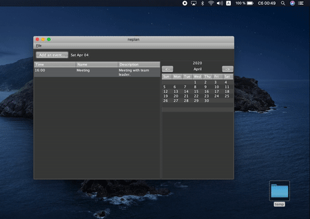
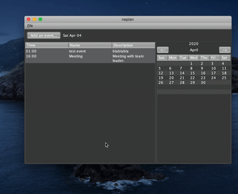

# NePlan
Daily planner on java created by wildmaus and nerinos

## Description:
* Allows you to create events
* You can also export and import your neplan calendars to and from file
* Reminds half an hour before the event by sending os notification
* Sorts your events by time
## Preview:

